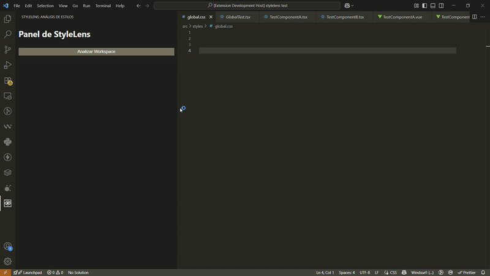

# StyleLens ✨ – Smart Visual Refactor
👉 [Download Here](https://marketplace.visualstudio.com/items?itemName=DavidVerde.stylelens) 

**StyleLens** is an intelligent VS Code extension designed to help you detect, visualize, and refactor repeated or poorly structured CSS styles in your modern frontend projects.

Keep your style codebase clean, consistent, and maintainable. Say goodbye to duplicate CSS and long utility class lists!

---

## Why StyleLens?

In large projects using frameworks like Tailwind CSS, it's easy to end up with the same class combinations (`flex items-center justify-between...`) repeated across dozens of components. This leads to:
- **Inconsistency**: A small change requires editing multiple files
- **Maintenance headaches**: Where is this style used? Is it safe to change?
- **Code bloat**: Long class lists that make markup harder to read

StyleLens tackles this problem head-on, giving you the tools to refactor with confidence.

## 🚀 Key Features

- **Multi-Framework Analysis**: Detects duplicate styles in **React (JSX/TSX), Vue, and Svelte (coming soon)**
- **Visual Dashboard**: Get a global view of all repeated styles in your project from a dedicated sidebar
- **One-Click Refactoring**:
  - **In-editor**: Contextual suggestions (CodeLens) appear directly on repeated code
  - **From panel**: Refactor groups of duplicate styles across your entire project with a single button
- **Smart Extraction**: Automatically extract utility class combinations into new reusable CSS classes (using `@apply` for Tailwind)
- **Quick Navigation**: Click results in the panel to jump directly to problematic code

## 🎬 Demo

## 🛠️ Supported Technologies

- **Frameworks**: React, Next.js, Vue, Nuxt, Svelte (coming soon), SvelteKit (coming soon), Astro
- **Languages**: HTML, JSX, TSX, Vue, Svelte (coming soon)
- **Styles**: Utility classes (Tailwind CSS, etc.), regular CSS classes

  
## Installation
1. Open VS Code
2. Go to Extensions view (Ctrl+Shift+X)
3. Search for "StyleLens"
4. Click Install
   
## ⚙️ How to Use

1. **Open StyleLens Panel**: Click the StyleLens icon in VS Code's activity bar
2. **Analyze Your Project**: Click "Analyze Workspace" button
3. **Explore Results**: The panel will show a table of all duplicate styles, their occurrence count, and file locations
4. **Refactor**:
   - Click "Refactor" in the panel to fix a group of duplicates project-wide
   - Or work directly in the editor with inline suggestions

## 🗺️ Future Roadmap (v2.0+)

StyleLens is under active development. Planned features include:
- **Similarity Detection**: Suggest merging styles that are nearly identical (e.g., `p-4` vs `p-5`)
- **CSS-in-JS Support**: Analyze patterns in `styled-components` and `Emotion`
- **Design Token Suggestions**: Detect raw values (`margin: 16px`) and suggest creating design tokens (`spacing-md`)
- **Visual Heatmap**: Diagram showing which components share the most styles
- **Advanced Configuration**: Allow ignoring specific files, folders, or classes

---

Made with ❤️ by [David Verde]
